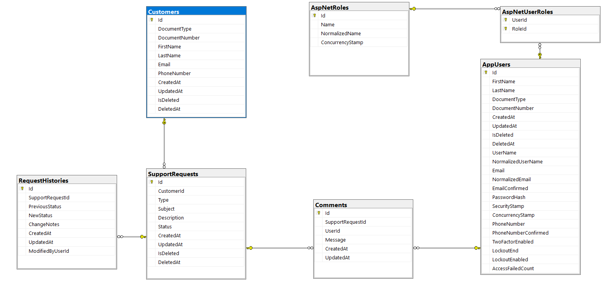

# HelpDeskManager API

1. [Descripción General de la Solución](#descripcion-general)
2. [Decisiones Técnicas Tomadas](#decisiones-tecnicas)
3. [Cómo Ejecutar el Proyecto](#ejecucion)
4. [Cómo Probar la Autenticación](#autenticacion)
5. [Cómo Probar los Flujos Principales](#flujos-principales)
6. [Próximos Pasos y Mejoras Futuras](#mejoras-futuras)

## 1. Descripción General de la Solución <a id="descripcion-general"></a>

**HelpDeskManager** es una API RESTful diseñada para centralizar y optimizar el flujo de trabajo en la gestión de solicitudes dee diferente indole dentro de lo que se conoce como soporte técnico (tickets). Su objetivo principal es garantizar la trazabilidad completa de cada solicitud, permitiendo un seguimiento detallado y seguro de los cambios de estado durante todo su ciclo de vida, desde su creación hasta su resolución.

## 2. Decisiones Técnicas Tomadas <a id="decisiones-tecnicas"></a>

### Arquitectura y Patrones de Diseño
Para el desarrollo de esta solución, se optó por una **Arquitectura N-Capas (N-Tier)**. Esta decisión toma fuerte inspiración de los principios de *Clean Architecture* (separación de responsabilidades e inversión de dependencias), pero se adaptó para no sobre-complicar la implementación, resultando en una base de código escalable, mantenible y fácil de abordar para un MVP.

A nivel de acceso a datos, se implementaron los patrones **Repository** y **Unit of Work**. Esto permite centralizar y abstraer la orquestación de las consultas a la base de datos a través del ORM, garantizando transacciones atómicas y desacoplando por completo la lógica de negocio del acceso a la infraestructura.

### Estructura del Proyecto y Flujo de Dependencias
La solución está modularizada en distintos proyectos para garantizar un estricto flujo de dependencias:

```text
📁 HelpDeskManager
 ├── 📁 src
 │   ├── 📁 HelpDeskManager.API    # (Presentación: Controladores, Middlewares, Program.cs)
 │   ├── 📁 HelpDeskManager.BLL    # (Lógica de Negocio: Servicios, Validaciones)
 │   ├── 📁 HelpDeskManager.Core   # (Dominio: Entidades POCO, DTOs, Mappers Enums e Interfaces)
 │   └── 📁 HelpDeskManager.DAL    # (Acceso a Datos: DbContext, Migrations, Repositorios y UnitOfWork)
 ├── 📁 tests
 │   ├── 📁 HelpDeskManager.API.Tests
 │   └── 📁 HelpDeskManager.BLL.Tests
 ├── 🐳 docker-compose.yml
 └── 📄 HelpDeskManager.slnx
 ```

 **Reglas de comunicación entre capas:**
* **`Core`**: Es el núcleo independiente del sistema. No tiene referencias a ningún otro proyecto.
* **`DAL`**: Referencia a `Core` para implementar las interfaces de los repositorios y mapear las entidades a la base de datos.
* **`BLL`**: Referencia a `Core` y `DAL`. Contiene los servicios que aplican las reglas de negocio (ej. cláusulas de guarda para los cambios de estado de un ticket).
* **`API`**: Referencia a `BLL` y `Core` (y a `DAL` exclusivamente para la configuración de la inyección de dependencias en el contenedor de IoC).

### Stack Tecnológico
* **Framework:** Desarrollado íntegramente sobre **.NET 9**.
* **ORM:** **Entity Framework Core 9** para el mapeo objeto-relacional.
* **Base de Datos:** **SQL Server**, contenedorizado vía Docker para facilitar los entornos de desarrollo y pruebas.
* **Gestión de Usuarios:** Integración con **ASP.NET Core Identity** para lograr una gestión de identidades y credenciales estandarizada y robusta.

### Seguridad y Autenticación
Se implementó un esquema de seguridad *stateless* utilizando **JSON Web Tokens (JWT)**.
* Durante el inicio de sesión exitoso, se emite un token cuyos *claims* incluyen la identidad del usuario y sus roles asignados.
* Esto permite aplicar **Políticas de Autorización (Policies)** de forma declarativa directamente en los controladores y endpoints.
* Por filosofía de seguridad, la API está restringida por defecto (`[Authorize]`); únicamente los endpoints estrictamente necesarios (como el login y el registro) están expuestos al público.

### Sistema de Roles y Permisos

La plataforma clasifica a los usuarios en tres perfiles operativos:

* **Admin (Administrador):** Posee control total sobre el sistema. Cuenta con permisos de lectura, escritura y modificación a nivel global en la aplicación, incluyendo la gestión del ciclo de vida de cualquier solicitud y la administración de usuarios.
* **Agent (Agente):** Perfil operativo enfocado en la atención. Tiene privilegios de lectura y escritura sobre la base de clientes, así como la autorización para crear nuevas solicitudes y gestionar su resolución operativa.
* **Reader (Lector):** Perfil diseñado para auditoría o consulta. Cuenta exclusivamente con permisos de solo lectura para visualizar el directorio de clientes y consultar el estado o historial de las solicitudes, sin capacidad de alterar los datos del sistema.

### Modelo de Datos


### Estrategia de Pruebas (Testing)
Se adoptó un enfoque de testing estructurado, logrando un conjunto inicial de **9 pruebas automatizadas** (6 unitarias y 3 de integración) para asegurar la fiabilidad de los flujos críticos:
* **Pruebas Unitarias:** Enfocadas en el aislamiento lógico. Validan el correcto comportamiento del generador de tokens, la aplicación de reglas de negocio al transicionar el estado de una solicitud, y garantizan que los errores esperados (ej. credenciales inválidas) devuelvan los objetos correctos.
* **Pruebas de Integración:** Enfocadas en el ciclo de vida HTTP. Validan de punta a punta que los mecanismos de autenticación y la seguridad por roles (RBAC) bloqueen o permitan el acceso a los endpoints según el perfil del usuario.

## 3. Cómo Ejecutar el Proyecto <a id="ejecucion"></a>

El ecosistema de la aplicación está diseñado para ser flexible, ofreciendo soporte tanto para una ejecución ágil y aislada mediante contenedores, como para un despliegue nativo directo en la máquina de desarrollo.

### Opción A: Ejecución con Docker
La solución incluye una configuración lista para **Docker** y **Docker Compose**, lo que permite levantar todo el entorno (API + Base de Datos) en segundos sin necesidad de instalar dependencias globales en el sistema operativo.

* **Infraestructura contenedorizada:** El archivo `docker-compose.yml` utiliza una imagen con el SDK de **.NET 9** para compilar y ejecutar la API en un entorno Linux aislado, junto con una imagen oficial de **Microsoft SQL Server 2022** para la persistencia de datos.
* **Pasos para la ejecución:**
    1.  Abra una terminal en la raíz del proyecto (donde se ubica el archivo `docker-compose.yml`).
    2.  Ejecute el siguiente comando para compilar e iniciar los servicios en segundo plano:
        ```bash
        docker-compose up -d --build
        ```
* **Personalización:** Se recomienda revisar el archivo `docker-compose.yml` antes de iniciar para validar o reconfigurar los puertos expuestos a las necesidades o gustos del usuario.

---

### Opción B: Ejecución Local (Sin Docker)
Si prefiere ejecutar la aplicación directamente de forma nativa, asegúrese de cumplir con los siguientes prerrequisitos en su estación de trabajo:
* Tener instalado el SDK de **.NET 9**.
* Contar con un motor de base de datos **SQL Server** activo.

#### 1. Modificación del archivo de configuración
Deberá actualizar la cadena de conexión para indicarle a la API dónde se encuentra su servidor local y qué credenciales utilizar. Abra el archivo `src/HelpDeskManager.API/appsettings.Development.json` y modifique el bloque `ConnectionStrings` siguiendo este ejemplo:

```json
{
  "Logging": {
    "LogLevel": {
      "Default": "Information",
      "Microsoft.AspNetCore": "Warning",
      "Microsoft.Hosting.Lifetime": "Information"
    }
  },
  "ConnectionStrings": {
    "DefaultConnection": "Server=TU_SERVIDOR_LOCAL;Database=HelpDeskManager_DB;Trusted_Connection=True;TrustServerCertificate=True;"
  }
}
```
> 💡 **Notas de configuración local:**
> * Reemplace `TU_SERVIDOR_LOCAL` por el nombre real de su instancia física (por ejemplo, `localhost\\SQLEXPRESS` o simplemente `.` si es una instancia por defecto).
> * El ejemplo anterior utiliza `Trusted_Connection=True` (Autenticación de Windows). Si su motor local utiliza autenticación por usuario y contraseña, cambie ese fragmento por: `User Id=sa;Password=TuPasswordSeguro;`.

Adicionnalmente, [la colección de postman](./assets/HelpDesk-net9.postman_collection.json) viene configurada para apuntar a la URL local con el puerto de docker (`http://localhost:8080`). Al ejecutarlo de manera local por favor cambie la variable de entorno de la colección a la siguiente url. (`https://localhost:7280`) si la ejecuta por https o (`http://localhost:5103`) si la ejecuta por http.

#### 2. Comandos para iniciar la aplicación
Navegue en su terminal hasta el directorio del proyecto de presentación (`src/HelpDeskManager.API`) y ejecute cualquiera de las siguientes alternativas:

* **Modo estándar:**
    ```bash
    dotnet run
    ```
* **Modo desarrollo (Compilación en caliente al guardar cambios):**
    ```bash
    dotnet watch
    ```
* Alternativamente, puede abrir la solución global `HelpDeskManager.slnx` desde su IDE preferido (Visual Studio, VS Code o Rider) y presionar la tecla **F5** para iniciar la depuración.

---

### Inicialización Automática de la Base de Datos (Migraciones y Seed)
No es necesario ejecutar scripts SQL manuales ni herramientas de consola adicionales para preparar la base de datos. La API cuenta con una rutina automatizada en su ciclo de arranque que realiza las siguientes tareas de forma transparente:

1.  **Ejecución de Migraciones:** Al iniciar, Entity Framework Core verifica el estado del servidor físico, crea la base de datos `HelpDeskManager_DB` si no existe y aplica todas las migraciones del historial para estructurar las tablas de negocio e Identity.
2.  **Semillero de Datos (Seed):** Si la base de datos es nueva, el sistema inyecta automáticamente los datos maestros iniciales indispensables para el testing, incluyendo la creación de los tres roles del sistema (`Admin`, `Agent`, `Reader`) junto con usuarios de prueba preconfigurados para cada rol.

### Solución de Problemas
Si la ejecución local falla arrojando errores de inicio de sesión o fallas de red con la base de datos:
1.  Asegúrese de que el servicio de SQL Server local se encuentre actualmente en estado "Ejecutándose" en el administrador de servicios de Windows.
2.  Valide la sintaxis de las barras invertidas en el archivo `appsettings.Development.json`. En cadenas JSON, los nombres de instancias locales con subcarpetas requieren escapar caracteres (ej. usar `Server=localhost\\\\SQLEXPRESS;`).

## 4. Cómo Probar la Autenticación <a id="autenticacion"></a>

Para facilitar las pruebas de autorización y los flujos de Control de Acceso Basado en Roles (RBAC), la base de datos se inicializa automáticamente con tres usuarios preconfigurados. Cada uno representa un nivel distinto de permisos dentro de la plataforma.

Para obtener un token de acceso, debe realizar una petición `POST` al endpoint de autenticación (`auth/login`) utilizando cualquiera de los siguientes cuerpos de petición (Body) en la pestaña *raw*:

**Perfil Administrador (Admin)**
*Tiene acceso total a todos los endpoints del sistema.*
```json
{
  "email": "admin@test.com",
  "password": "Pa$$w0rd"
}
```
**Perfil Agente (Agent)**
*Puede gestionar clientes y operar sobre las solicitudes de soporte.*
```json
{
  "email": "agent@test.com",
  "password": "Pa$$w0rd"
}
```
**Perfil Lector (Reader)**
*Restringido únicamente a operaciones de consulta (GET).*
```json
{
  "email": "reader@test.com",
  "password": "P$$w0rd"
}
```

### Pruebas Automatizadas con Postman

Se ha adjuntado una colección de Postman preconfigurada para agilizar la validación de la API. [Esta colección](./assets/HelpDesk-net9.postman_collection.json) incluye ejemplos estructurados y scripts de automatización para mejorar la experiencia de prueba:

* **Inyección Automática del Token:** La colección está diseñada para que, con solo ejecutar exitosamente el endpoint de Login una vez, el script de pruebas de Postman capture el token JWT de la respuesta y lo asigne automáticamente como *Bearer Token* a todas las peticiones posteriores. No es necesario copiar y pegar el token manualmente entre peticiones.
* **Manejo de Identificadores (IDs):** Los ejemplos dentro de la colección contienen esquemas base. Al probar endpoints que requieren un `id` específico por parámetro de ruta o en el cuerpo de la petición (ej. actualizar una solicitud), es indispensable reemplazar los IDs de ejemplo por identificadores (GUIDs) válidos. 
* **¿De dónde obtener los IDs?** Puede utilizar los IDs generados al crear nuevos registros durante sus pruebas, o utilizar los IDs base que se encuentran en la base de datos despues de ejecutar el seed o tambien se encuentran estructurados en el archivo `seedData.json`, ubicado dentro de la carpeta `Data` en el proyecto de la API (`src/HelpDeskManager.API/Data/seedData.json`).

## 5. Cómo Probar los Flujos Principales <a id="flujos-principales"></a>

El núcleo operativo de la API es la gestión de solicitudes de soporte (tickets). El flujo principal garantiza que toda solicitud nazca vinculada a un cliente, evolucione de forma controlada a través de distintos estados y mantenga un registro histórico estricto de cada cambio o comentario añadido.

### Módulos de la API y Control de Acceso

La aplicación está dividida en cuatro módulos principales, cada uno con restricciones de seguridad específicas según el rol del usuario autenticado:

* **Autenticación (`/api/auth`):** Estos endpoints son públicos y no tienen restricciones de rol. Son el punto de entrada indispensable para obtener el token JWT y consumir el resto de la aplicación.
* **Usuarios (`/api/users`):** Acceso exclusivo para el rol **Admin**. Permite la administración total del personal: consulta de usuarios por ID o número de documento, listado general con paginación, consulta de roles disponibles y asignación de roles a los empleados.
* **Clientes (`/api/customers`):** Los usuarios **Admin** y **Agent** tienen permisos completos de lectura, creación y actualización. El rol **Reader** está limitado a solo lectura. La eliminación de clientes (Delete) es una acción que aplica un soft-delete sobre el registro, que está reservada estrictamente para el **Admin**.
    * *Tipos de documento soportados:* CC (Cédula de ciudadanía), CE (Cédula de extranjería), NIT (Número de identificación tributaria), TI (Tarjeta de identidad) y Passport (Pasaporte).
* **Solicitudes (`/api/supportrequests`):** Los usuarios **Admin** y **Agent** pueden leer, crear y gestionar el ciclo de vida de las solicitudes. El rol **Reader** solo puede consultar la información.

### Ciclo de Vida de una Solicitud (Flujo de Pruebas)

Para probar el flujo de extremo a extremo, se recomienda seguir este orden lógico:

**1. Consulta y Filtrado Avanzado**
El listado de solicitudes cuenta con un motor de búsqueda que permite combinaciones de filtros a través de parámetros en la URL. Puede probar filtrar por: ID del cliente, Estado, Tipo de solicitud, Rango de fechas (Desde/Hasta) y paginación (Número y Tamaño de página).

**2. Creación de la Solicitud**
Para crear una solicitud, es requisito indispensable contar con el ID de un cliente existente. Al enviar el payload (tipo, asunto y descripción), el sistema automáticamente inicializa la solicitud en el estado **Created** y registra un registro histórico inicial de apertura.

**3. Edición de Datos Base**
Si se requiere corregir una solicitud, el sistema solo permite editar la información descriptiva: Tipo de solicitud, Asunto y Descripción. 
* *Tipos de solicitud disponibles:* SupportCase (Caso de soporte), InternalRequirement (Requerimiento interno), OperationalIncident (Incidente operativo) y CustomerProcedure (Trámites o procedimientos).

**4. Interacción y Comentarios**
Los agentes y administradores pueden registrar comentarios utilizando el ID de la solicitud. Cada comentario guarda automáticamente la trazabilidad del autor y la fecha, los cuales pueden ser visualizados en los endpoints de consulta de detalle.

**5. Transición de Estados y Trazabilidad**
El cambio de estado es el proceso más crítico y está protegido por reglas de negocio. Al cambiar de estado, se debe adjuntar una nota justificando la acción. Por cada cambio exitoso, el sistema genera un **registro histórico** para auditoría.

* *Estados disponibles:* Created (Creado), UnderReview (En revisión), Resolved (Resuelto), Closed (Cerrado) y Canceled (Cancelado).
* **Restricciones de negocio a probar:**
    * No es posible cambiar el estado de una solicitud que ya se encuentra cerrada (`Closed`).
    * El sistema rechazará la petición si se intenta asignar el mismo estado que la solicitud ya posee.
    * No se puede forzar el cierre (`Closed`) de una solicitud si su estado inmediatamente anterior no era resuelto (`Resolved`).

> **Nota:** Para un detalle exacto de las rutas, los esquemas JSON (Payloads) y las respuestas de éxito o error, consulte la [colección de Postman](./assets/HelpDesk-net9.postman_collection.json) provista o navegue a través de la interfaz interactiva de **Swagger UI** que se levanta al ejecutar la API.

## 6. Próximos Pasos y Mejoras Futuras <a id="mejoras-futuras"></a>

Este proyecto fue desarrollado como un Producto Mínimo Viable (MVP). Si dispusiera de más tiempo para iterar sobre la solución, enfocaría los esfuerzos en los siguientes frentes para llevar la aplicación a un entorno más maduro y robusto:

### Mejoras a Nivel de Funcionalidad (Producto)
* **Identificadores Amigables (Ticket Numbers):** Cambiaría la forma en que los usuarios buscan e identifican las solicitudes. En lugar de utilizar un identificador global complejo (GUID), implementaría un código correlativo corto y fácil de leer (por ejemplo, `REQ-10042`.
* **Gestión de Sesiones Seguras:** Implementaría un flujo de *Refresh Tokens* almacenados a través de *cookies HTTP-only* cuando se integre con un frontent. Esto no solo mejoraría la experiencia del usuario al mantener su sesión activa de forma segura, sino que habilitaría un mecanismo real para el cierre de sesión (Logout).
* **Autogestión de Clientes:** Robustecería el flujo de creación. Actualmente, las solicitudes son creadas internamente por los agentes o administradores (usuarios de la aplicación); el siguiente paso lógico sería habilitar la opción para que los propios clientes puedan generar y hacer seguimiento a sus tickets directamente.
* **Trazabilidad de Autoría:** Reforzaría el modelo de datos para vincular y registrar automáticamente el ID exacto del empleado que creó o intervino en la apertura de una solicitud, fortaleciendo la auditoría interna.
* **Administración Integral de Usuarios y Solicitudes:** Ampliaría el módulo de gestión de personal más allá de la creación y consulta, agregando flujos completos de actualización de perfiles, desactivación de cuentas (soft-delete) y restablecimiento de credenciales. Del mismo modo con la solicitudes, ampliar las capacidades de gestion de las solicitudes para permitir un mayor control y granulabilidad sobre los que se realiza en las solicitudes, como por ejemplo la asignación de tickets a agentes específicos, la posibilidad de reabrir solicitudes cerradas o la implementación de un sistema de prioridades.

### Mejoras a Nivel de Arquitectura y Código
* **Evolución del Diseño Arquitectónico:** Si la aplicación demostrara una necesidad de escalar masivamente, evaluaría evolucionar la arquitectura actual hacia patrones más avanzados que permitan separar las operaciones de lectura y escritura, optimizando el rendimiento ante un alto volumen de tráfico.
* **Validaciones Centralizadas:** Robustecería el sistema de validación de datos de entrada en toda la API (implementando librerías especializadas como *FluentValidation*). Esto permitiría atrapar errores de formato de manera automática y estandarizada mucho antes de que la información toque la lógica de negocio.

